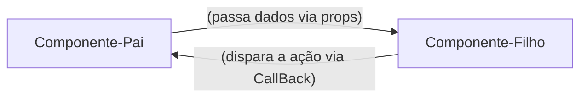

# REACT - Guia Rápido e Anotações

**Unidade Curricular:** Desenvolvimento FrontEnd
**Conteúdo:** Desenvolvimento de Frameworks - REACT

## Semana 1 - Introdução ao React e Ambiente de Desenvolvimento

### 1. O que é React?

- Uma Biblioteca JavaScript para criação de interfaces de Usuário (UI)
- Funciona de forma **declarativa**: você descreve o resultado esperado com base nos dados, e o REACT atualiza o navegador.
- Cria *SPAs* (Single Page Applications): atualiza partes da tela sem recarregar a página inteira.

### 2. React vs JavaScript Vanilla: DOM Tradicional vs Virtual DOM

O DOM no JavaScript Tradicional é Imperativo: procura a tag. muda o componente e atualiza a página

React (Declarativo): UI = Componente(dados) -> Quando os dados mudam, o React atualiza o componente.

### 3. Comandos essenciais no terminal

```bash
#Criar projeto com o VITE(framework react)
npm create vite@latest nome-projeto --template react

#atualizar e instalar depêndencias do node_modules
npm install

# Iniciar o servidor local (http://localhost:5173)
npm run dev

```

### 4.Sintaxe do primeiro componente JSX (permite escrever códigos parecidos com HTML diretamente dentro do arquivo de script)

```jsx
//src/App.js
//Componente Raiz de Aplicação
function App(){
    const sistema = "Meu Site";

    return(
        <main>
            <h1>{sistema}</h1>
            <p>Gerencie seus componentes em um só lugar</p>
        </main>
    );
}

export default App;
```

> Obs: O JSX exibe **uma única tag raiz** (ou fragmento `<> ... </>`) e nomes de componentes sempre começam com a letra **Maiúscula** (UpperCamelCase).

---

## Semana 2 - JSX, Componentes Única (SOLID)
- Quebrar a tela em componentes pequenos. Cada componente deve fazer apenas uma unica coisa bem feita:

**Exemplo de componentes:**
- `Header`: cuida do título e do cabeçalho da aplicação
- `Footer`: cuida do rodapé da aplicação
- `NavBar`: cuida da barra de navegação do site

> obs: o principio do SoliD estabelece que uma unidade de software deve ter apenas um motivo para mudar

### 2. Props: passagem de dados e fluxo unidirecional

**O que são Props?** 

Os props são argumentos ou parametros das funções já que um componente REACT é uma função JavaScript, ou seja, as props (abreviação de properties) permitem que o componente pai envie dados dinamicamente para o componente filho, tornando-o customizavel e reutilizável. 

### 3. Eventos e comunicação via Callbacks

React encapsulamento de eventos nativos em objetos, a diferença do react para o HTML é a sintaxe
- No HTML: `onclick="minhafuncao()`
- No React JSX: `onclick={minhafuncao}`

> funções em JavaScript deve sguir o padrão lowerCamelCase de escrita.



### 4. Lista dinâmicas com map() e a propriedades `key`

**Porque Arrays são estruturas padrão do FrontEnd?**
Os dados chegam de banco de dados e apis no formato de coleção (json) 

o método `.map()` percorre cada item de uma array e retorna um novo componente JSX

Exemplo:

```jsx
tarefas.map((tarefa)=>(
    <TarefaItem
        key={tarefa.id}
        id={tarefa.id}
        titulo={tarefa.titulo}
        descricao={tarefa.descricao}
        conpleta={tarefa.com}
    />
))
```
**Porque o React exige um `key` no uso do `.map()`**

O React quando renderiza uma lista precisa saber de forma inequívoca qual item específico foi adicionado, alterado ou removido. Se a chave for omitida, o react emite um aviso no console: 
`Warning: Each child in a list should have a unique "key" prop.`

> evitar o índice do array como chave `(key={index})`: índice do vetor não é fixo, use sempre uma chave única para os itens da lista (carimbo de data e hora, id único)

### Componentes de Formulário Estático:
Criando o Arquivo `TarefaForm.jsx`
